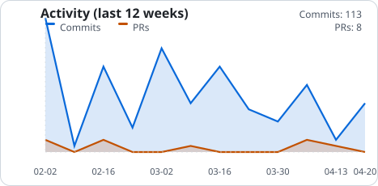
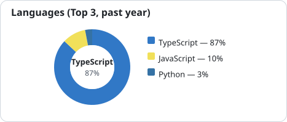

<table style="width: 100%; border-collapse: separate; border-spacing: 12px 12px;">
  <tr>
    <td width="50%" valign="top">
      <picture>
        <source srcset="./profile/activity-dark.svg" media="(prefers-color-scheme: dark)" />
        <source srcset="./profile/activity.svg" media="(prefers-color-scheme: light)" />
        
      </picture>
    </td>
    <td width="50%" valign="top">
      <picture>
        <source srcset="./profile/langs-dark.svg" media="(prefers-color-scheme: dark)" />
        <source srcset="./profile/langs.svg" media="(prefers-color-scheme: light)" />
        
      </picture>
    </td>
  </tr>
  <tr>
    <td colspan="2" style="padding-top: 4px;">
      <h3>Hi there 👋</h3>
      
Front-end developer shipping small open-source utilities whenever time allows. Client work keeps me a bit quiet here, but I'm hoping to lean into the Vibe Coding wave and show up more often.

    </td>
  </tr>
</table>
